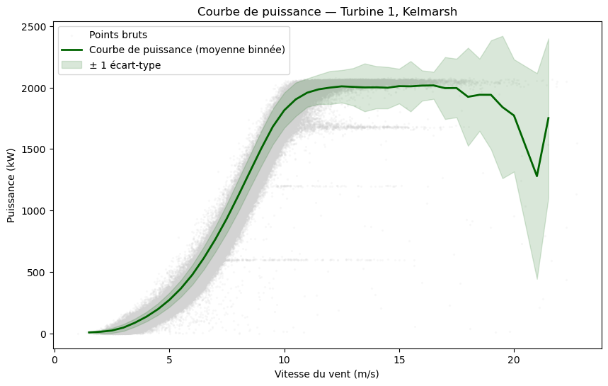
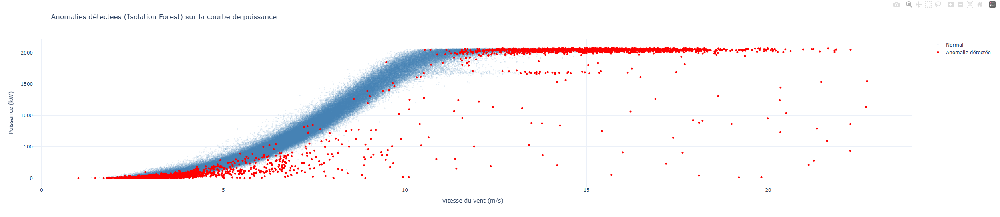
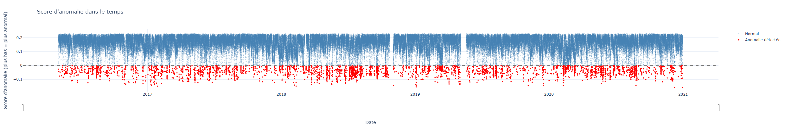
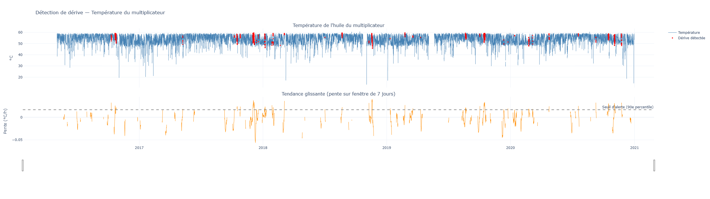

# 🌬️ Analyse de performance et détection d'anomalies — Parc éolien

## 🧠 En bref

Ce projet exploite des données réelles (capteurs, production, températures, statuts) d'une
turbine du parc éolien de Kelmarsh pour :

1. Construire la **courbe de puissance** de la turbine, la référence de comportement normal
   reliant vitesse du vent et puissance produite.
2. Détecter des **anomalies multivariées** via un Isolation Forest, en combinant plusieurs
   variables plutôt qu'un seul indicateur de performance.
3. Identifier des **dérives temporelles progressives** via une analyse de tendance glissante,
   en complément d'Isolation Forest qui n'a aucune notion de continuité dans le temps.
4. Fournir des **visualisations interactives** (Plotly) permettant d'explorer ces résultats
   dans leur contexte temporel et opérationnel.

L'objectif est de démontrer une approche de data science appliquée à la maintenance
industrielle : partir de données brutes non labellisées, construire une référence métier
interprétable, puis superposer deux angles de détection d'anomalies complémentaires, l'un
ponctuel et multivarié, l'autre temporel et ciblé.

---

> Modélisation de la courbe de puissance, détection d'anomalies multivariées et suivi de
> dérive temporelle sur des données réelles d'un parc éolien, combinant Isolation Forest
> et analyse de tendance glissante.






---


## 📋 Sommaire

- [Le problème](#-le-problème)
- [Méthodologie](#-méthodologie)
- [Résultats](#-résultats)
- [Limites](#-limites)
- [Installation et utilisation](#-installation-et-utilisation)
- [Structure du projet](#-structure-du-projet)
- [Dataset](#️-dataset)
- [Pistes d'amélioration](#-pistes-damélioration)
- [Stack technique](#-stack-technique)

---

## 🌱 Le problème

Le suivi de performance d'un parc éolien repose en grande partie sur la détection précoce de
sous-performances ou de dérives mécaniques, avant qu'elles ne se traduisent par une panne ou une
perte de production significative. Les données fournissent un volume important de mesures en
continu, mais sans label indiquant explicitement les périodes anormales, un contexte typique en
maintenance industrielle, où la détection d'anomalies doit s'appuyer sur des méthodes non
supervisées.

## 🔍 Méthodologie

**1. Courbe de puissance :** 
Construction de la courbe de puissance selon la méthode standard de binning par tranche de
vitesse de vent (largeur 0.5 m/s, cohérente avec la norme IEC 61400-12), après exclusion des
périodes d'arrêt de la turbine. Cette courbe sert de référence de comportement attendu.

**2. Détection d'anomalies multivariée :** 
Un Isolation Forest est entraîné sur sept variables couvrant différents sous-systèmes de la
turbine (vitesse du vent, puissance, vitesse de rotor, température de l'huile du multiplicateur,
température du palier du générateur, température de la nacelle, angle de pale). Ce choix permet
de détecter des anomalies invisibles sur la seule courbe de puissance, par exemple une
combinaison de légers écarts sur plusieurs variables, chacun insuffisant isolément pour être
qualifié d'anormal. Cette approche évalue chaque observation indépendamment des autres.

**3. Détection de dérive temporelle :** 
Pour compenser l'absence de continuité temporelle d'Isolation Forest, une seconde approche
calcule, heure par heure, la pente d'une régression linéaire glissante sur une fenêtre de 7
jours (168h) appliquée à une variable de température clé (huile du multiplicateur). Une pente
positive soutenue sur la durée signale une tendance à la hausse progressive, potentiellement
invisible à un instant T mais significative sur la durée. Le seuil d'alerte est fixé au 90e
percentile des pentes observées sur l'historique, faute de vérité terrain pour le calibrer plus
précisément.

**4. Visualisation :** 
Les résultats sont présentés via des graphiques Plotly interactifs (zoom, survol, navigation
temporelle), la localisation des anomalies ponctuelles sur la courbe de puissance, leur
répartition dans le temps, et un graphique à deux volets superposant température brute et pente
glissante pour la détection de dérive permettant de visualiser directement le lien entre
signal brut et tendance détectée.

## 📊 Résultats

| Indicateur | Valeur |
|---|---|
| Période analysée | 2016 – 2020 |
| Lignes utilisées pour la détection d'anomalies | ~216 000 |
| Anomalies ponctuelles détectées (Isolation Forest) | ~2% des observations (paramètre `contamination`) |
| Périodes de dérive détectées | Voir `drift_alert` dans le notebook, variable selon le seuil choisi |

La courbe de puissance obtenue est cohérente avec le comportement théorique attendu (démarrage
progressif dès ~3 m/s, plateau proche de la puissance nominale du modèle de turbine autour de
2 000 kW), ce qui valide la qualité du nettoyage préalable.

Les anomalies détectées par Isolation Forest ne présentent pas de clusters temporels marqués sur
la période observée, ce qui suggère des événements ponctuels et récurrents (transitoires, bruit
de mesure, conditions de vent atypiques) plutôt qu'une dégradation progressive continue sur
cette turbine.

La détection de dérive confirme cette lecture : les épisodes de pente positive soutenue
identifiés restent ponctuels et ne s'inscrivent pas dans une tendance de fond continue sur
plusieurs mois, cohérent avec une turbine ne présentant pas de signe de dégradation mécanique
progressive sur la période analysée. La température de l'huile du multiplicateur oscille dans
une plage (50-60°C) cohérente avec le fonctionnement normal d'un tel système, chauffé par
friction mécanique et généralement complété par un système de préchauffage, un point vérifié
explicitement plutôt que supposé, la plage de valeurs ayant d'abord semblé surprenante au regard
des conditions climatiques extérieures.

## ⚠️ Limites

**Isolation Forest** évalue chaque observation indépendamment, sans notion de continuité
temporelle. Une dérive lente et progressive peut ne jamais franchir individuellement le seuil
d'anomalie, même si la tendance est significative sur la durée, c'est la limite que la détection
de dérive vient partiellement compenser.

**La détection de dérive**, de son côté, a ses propres limites :
- Elle repose sur une **régression linéaire**, qui suppose une tendance approximativement
  constante sur la fenêtre observée. Une dérive non linéaire (accélération soudaine, paliers)
  serait moins bien capturée par une simple pente.
- Elle est appliquée **variable par variable** : la version actuelle surveille la température de
  l'huile du multiplicateur isolément, sans combiner plusieurs signaux comme le fait Isolation
  Forest.
- Le **seuil d'alerte** (90e percentile) est une heuristique statistique, pas un seuil validé
  par un expert métier ou par des données de panne réelles, une calibration plus rigoureuse
  nécessiterait un historique de maintenance documenté.
- La **taille de la fenêtre glissante** (7 jours) est un choix arbitraire ; une fenêtre plus
  courte capterait des dérives plus rapides au prix de plus de faux positifs, une fenêtre plus
  longue lisserait davantage mais retarderait la détection.

**Plus généralement**, les deux méthodes combinées restent des indicateurs statistiques, pas un
diagnostic causal : une anomalie ou une dérive détectée signale un écart par rapport au
comportement historique, sans identifier automatiquement son origine mécanique. Une validation
par un expert métier resterait nécessaire avant toute action de maintenance.

## 🚀 Installation et utilisation

```bash
# Cloner le repo
git clone https://github.com/Nirvathec/scada.git
cd scada

# Installer les dépendances
pip install -r requirements.txt

# Lancer le notebook
jupyter notebook 01_analysis.ipynb
```

Le notebook attend les données du parc de Kelmarsh dans un dossier `dataset/`, organisées
par année (voir [Dataset](#️-dataset) pour le téléchargement).

## 📁 Structure du projet

```
scada/
├── README.md
├── requirements.txt
├── 01_analysis.ipynb        # Notebook principal : courbe de puissance, anomalies et dérive
├── dataset/                 # Données (non versionnées, à télécharger séparément)
└── assets/
    └── ...                  # Captures d'écran pour ce README
```

## 🗂️ Dataset

[Kelmarsh Wind Farm Data](https://zenodo.org/record/8252025) — données réelles du parc
éolien de Kelmarsh (Royaume-Uni), en libre accès, couvrant plusieurs années et plusieurs
turbines à pas de temps 10 minutes.

## 🔭 Pistes d'amélioration

- **Test statistique de tendance** : remplacer le seuil empirique (percentile) par un test de
  significativité de tendance (par exemple Mann-Kendall), pour distinguer une dérive
  statistiquement significative d'une simple fluctuation.
- **Généralisation multivariée de la dérive** : étendre la détection de tendance à plusieurs
  variables simultanément (au-delà de la seule température d'huile), avec un score de dérive
  combiné plutôt qu'un suivi variable par variable.
- **Fusion des deux approches** : combiner le score Isolation Forest et le score de dérive en un
  indicateur de risque unique, capable de signaler à la fois les écarts ponctuels et les
  tendances progressives.
- **Requêtage SQL** : exploiter DuckDB ou SQLite pour des agrégations et comparaisons entre
  turbines directement en SQL, pertinent pour des analyses à l'échelle d'un parc entier.
- **Analyse d'importance des variables** : comparer les distributions des variables entre
  points normaux et anormaux pour identifier lesquelles contribuent le plus aux anomalies
  détectées.
- **Extension multi-turbines** : généraliser l'analyse à l'ensemble du parc pour comparer les
  profils d'anomalies et de dérive entre turbines, et identifier des effets de sillage ou des
  singularités propres à une machine.
- **Vers la maintenance prédictive** : si un historique de pannes ou d'interventions de
  maintenance devenait disponible, ces indicateurs (anomalie, dérive) pourraient servir de
  variables d'entrée à un modèle de durée de vie résiduelle (RUL) ou de survie, plutôt que de
  rester des signaux d'alerte non calibrés sur des événements réels.

## 🛠️ Stack technique

- **Traitement de données** : pandas, NumPy, SciPy (régression linéaire)
- **Modélisation** : scikit-learn (Isolation Forest, StandardScaler)
- **Visualisation** : Plotly (interactif, graphiques à volets multiples), Matplotlib
- **Format** : Jupyter Notebook

---

*Projet réalisé dans le cadre de mon portfolio en data science, avec un intérêt particulier pour
les applications à l'énergie et à la maintenance industrielle.*
*N'hésite pas à me contacter pour toute question : vergne.clement.49@gmail.com*